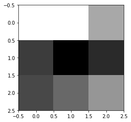
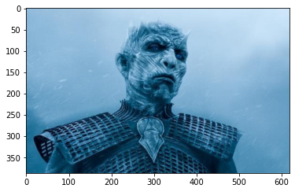
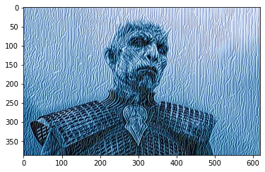
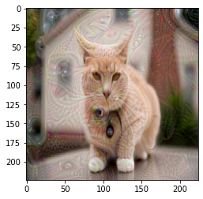

<h1 style="text-align:center"> AdversarialExampleForCNN </h1>

In this Notebook, we shall be looking at two subjects :

- A way to visualise what networks are learning : the Deep Dream algorithm
- Adversarial examples

## visualise what networks are learning  
* ### Single channel of a certain filter output : 

 we can display the output a certain filter in the convulational layers. But as you can probably see, this visualisation is not of much use : we cannot really tell what is going on in the network. For this, let's turn to another approach : Deep Dream !

* ### Deep Dream: 

The algorithm can be used for visualizations to understand the emergent structure of the neural network better.
It is a way to discover how the neural network sees the images along its layers 

Input Image            |  Output of layer 5 
:-------------------------:|:-------------------------:
  |  

## Adversarial example : 
In this part we will try to trick the neural network.
We will try to generate images from the those that the CNN classified correctly and turn it into slighty diffrent images that CNN fails to classify while a human is still able to classify correctly.

That raises the Question of faiabilty of the CNN in real life application . 

|Original Image            |  Modified Image 
:-------------------------:|:-------------------------:
  |  

CNN prediction for the Original Image | CNN prediction for the Original Image 
:-------------------------:|:-------------------------:
'Egyptian_cat': 0.6696185 |'reflex_camera': 1.0
'tabby': 0.12234392 | 'television': 4.4973e-09
'tiger_cat':0.091297895 | 'lens_cap': 3.5423042e-09

As you should probably see, the image is changed such that it is no longercorrectly classified. a cat image is classified as a 'reflex camera'. This is a problem, since a humain  is still able to see a cat.
